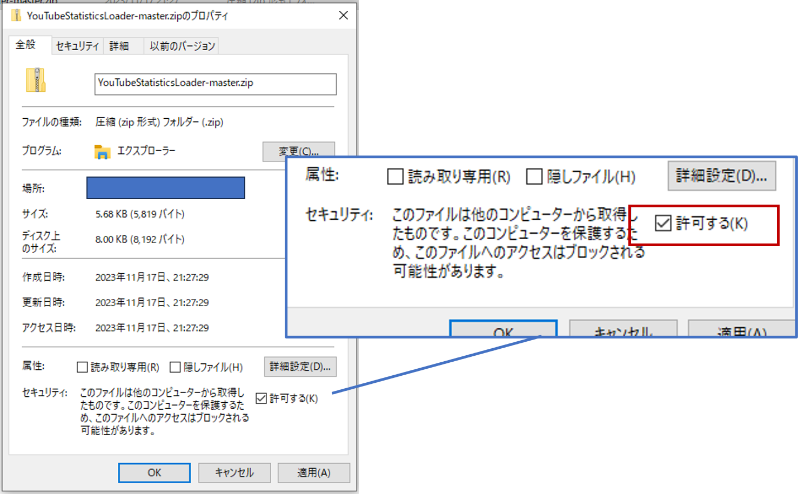

## シンプル YouTube リアルタイム統計情報ローダー for OBS

### 1. What's this?
YouTube の高評価の数や同時接続数 (準備中) をリアルタイムでシンプルな HTML ファイルに抽出するツールです。  
このツールを DL して起動し、視聴ページの URL を指定するだけで 35 秒ぐらいおきに最新の情報を取得します。

### 2. How to use
本ツールはダウンロードの上、お手元の Windows 環境で実行して頂く必要があります。

#### 2 - 1. Download
1. このリンクから最新版のツールを取得する  
https://github.com/a32kita/YouTubeStatisticsLoader/archive/refs/heads/master.zip
1. ZIP ファイルを右クリックし、[ プロパティ (R) ] をクリック  

1. プロパティ ウィンドウ最下部 "許可する (K)" のチェックをオンにする  

1. [ OK ] でプロパティ画面を閉じる
1. ZIP ファイルを任意のディレクトリに展開する

#### 2 - 2. Execute
1. youtube_statistics_loader.bat をクリックして実行する  

1. 視聴ページの URL を指定してください; (例: https://www.youtube.com/watch?v=XX) の次の行に視聴ページの URL を貼り付ける  

1. [ Enter ] キーを押下する

[ Enter ] キー押下後、一定の間隔ごとに指定したライブ配信枠から最新の情報を取得し、下記ファイルが出力・更新されます。

| No | ファイル名 | 内容 |
| - | - | - |
| 1 | youtube_like_count.html | 現在の高評価数 |
| 2 | youtube_listener_count.html | 現在の視聴者数 |

これらのファイルを OBS で投影することで、最新の高評価数、視聴者数を配信画面に載せることができます。

#### 2 - 3. OBS
1. OBS を開く
1. 本ツールで取得した情報を表示したいシーンを開く  

1. [ ソース追加 (+) ] のメニューから [ ブラウザ ] を選択する  

1. [ 新規作成 ] を選択し、任意の名前を入力し [ OK ] を押下する  

1. プロパティ画面で下記の値を設定する  
| 項目名 | 設定値 |
| - | - |
| ローカルファイル (チェック) | オン |
| ローカルファイル | [ 参照 ] ボタンを押下し、手順 2 - 2 - 1 (プログラムの実行) 後に出力される *.html ファイルを選択 ※視聴者数なら youtube_listener_count.html |
| 幅・高さ | 200 x 100 程度で設定し、見切れなどに応じて調整してください |
| カスタム CSS | フォント サイズや文字装飾などを設定できます (後述の例を参照) |  
  
OBS の設定は本ツールの格納先ディレクトリを変えない限りは初回のみの設定でご利用いただけます。

### 3. License
* 誰でもご自由にお使いいただけます
* 本ツールの使用により発生したトラブル等につきまして、作者は一切の責任を負いません
